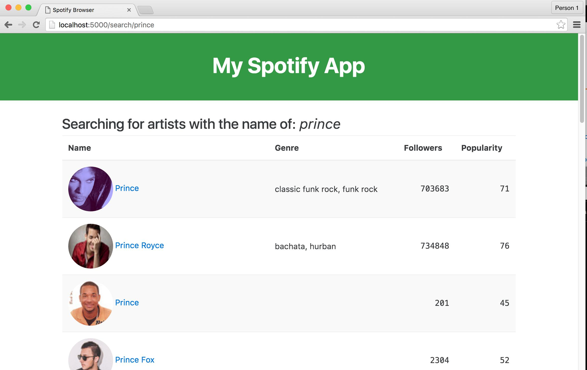

# Fun with Flask and the Spotify API

Another example of mixing data into our own Flask app. Using [Spotify's excellent API](https://developer.spotify.com/web-api/endpoint-reference/), we can fake a pretty complete app by just calling their API for data behind the scenes.

## References

Note: This app was written in Python 3.x and is meant for [Anaconda users to jump into without too much fuss](https://docs.continuum.io/anaconda/install).

The data (see samples in [samples/spotify](samples/spotify)) comes [directly from Spotify](https://developer.spotify.com/web-api/endpoint-reference/) and only uses the public, unauthenticated calls. At some point I'd love to pair it with the [Echo's Nest API](http://developer.echonest.com/docs/v4) (which Spotify owns).

The CSS styling comes [from Bootstrap 4](http://v4-alpha.getbootstrap.com/). The neat little HTML5 audio player comes [from the audio.js project](http://kolber.github.io/audiojs/).

The app as it stands is pretty basic; [if you can follow Flask's excellent documentation](http://flask.pocoo.org/docs/0.10/quickstart/), there shouldn't be too many surprises here.

## Clone and run the app

To try it out, you can clone this repo into some temp folder:

~~~sh
git clone https://github.com/datademofun/spotify-flask
cd spotify-flask
# run the app on localhost:5000
python app.py
~~~

Visit [http://localhost:5000/search/prince](http://localhost:5000/search/prince) in your browser to see a search results page:

Click on any of the results to go to an artist-specific page:

[http://localhost:5000/artist/5a2EaR3hamoenG9rDuVn8j](http://localhost:5000/artist/5a2EaR3hamoenG9rDuVn8j)

...Well, real-world data and negotiations of music rights isn't perfect...but it's pretty easy to scaffold a web app that simply makes API calls with each page request.

Like most commercial APIs, there are a number of Spotify API endpoints that require creating an account and going through OAuth. However, Spotify has a generous number of free-to-call APIs that don't require any authentication.

View the endpoint reference here: https://developer.spotify.com/web-api/endpoint-reference/

## Ideas

After you've scaffolded some of the basic endpoints, try to think of pages that can be built from multiple API calls and organizing of the data:

- Mash the [related-artists](https://developer.spotify.com/web-api/get-related-artists/) data with [top-tracks-by-artist](https://developer.spotify.com/web-api/get-artists-top-tracks/), so that instead of seeing artists related to Beyoncé, you see related artists _and_ their 3 top-tracks for easy sampling.
- For a group of artists, generate a playlist of the m[ost popular track of their most popular album](https://developer.spotify.com/web-api/get-album/).
- Given an artist with a large discography, generate a list of tracks that span the (choronological) extremes of their career, as well as selections that _don't_ have a high "popularity" according to Spotify.

#  Sampling the data

The [samples/spotify directory](samples/spotify) contains several samples of the API response. 

The `artists/` endpoint ([documentation](# https://developer.spotify.com/web-api/get-artist/)) produces this JSON for Beyoncé: [samples/spotify/get-artist.json](samples/spotify/get-artist.json)

# Interacting with the API from ipython

Jump into ipython at the top-level directory, and import the [datafoo/spotify](datafoo/spotify.py) module:

~~~py
from datafoo import spotify
results = spotify.search_by_artist_name('Weird Al Yankovic')
~~~

As with every kind of data under the sun, the data of the music industry reveals its complexity even in the simple API endpoints. How many "Weird Al's"
could there be?

First of all, `results` is not just a list, but a nested-nested dictionary (see the raw text at [samples/spotify/search-item.json](samples/spotify/search-item.json):

~~~py
artists = results['artists']
artists.keys()
#  dict_keys(['limit', 'previous', 'offset', 'total', 'next', 'href', 'items'])
artists = artists['items']
len(artists)
# 4
~~~

Let's print out their names:

~~~py
for a in artists:
    print(a['name'])
~~~

~~~stdout
"Weird Al" Yankovic
Barnes & Barnes w/ Weird Al Yankovic
Karaoke - "Weird Al" Yankovic
Karaoke - Yankovic, "Weird Al"
~~~

It's not just Weird Al, but all of the knockoffs. Luckily, Spotify puts the most "popular" Weird Al at the top:

~~~py
for a in artists:
    print(a['id'], a['name'], a['followers']['total'])
~~~

Because there are so many variations on a given artist name, we can't get detailed artist data using their human-readable name alone. Spotify, as most big-data-service, creates unique-hard-to-memorize-ids for every unique entity in their database. It's not as convenient as just looking up things by popular name, but it's the only way to be precise with so much clutter in the music data.

To get the artists related to (the real) Weird Al, in terms of similar fans:

~~~py
id = artists[0]['id']
related_artists = spotify.get_related_artists(id)
for a in related_artists['artists']:
    print(a['name'], a['followers']['total'])
~~~

~~~stdout
Stephen Lynch 45184
Jonathan Coulton 38976
South Park 8665
Flight of the Conchords 120360
The Simpsons 7526
Arrogant Worms 2354
Tom Lehrer 10358
Bob Rivers 3246
Jon Lajoie 38035
Adam Sandler 26157
Da Vinci's Notebook 11572
Liam Lynch 3208
Monty Python 31663
Richard Cheese 49472
The Lonely Island 519152
Corky and the Juice Pigs 344
Denis Leary 6490
Bo Burnham 96074
Trey Parker 802
Tim Minchin 30303
~~~

...And to get the related artists out of all of those related artists...

~~~py
id = artists[0]['id']
all_artists = []
related_artists = spotify.get_related_artists(id)
for a in related_artists['artists']:
    moredata = spotify.get_related_artists(a['id'])
    all_artists.extend(moredata['artists'])
~~~

Where does this magic function of `spotify.get_related_artists()` come from? It's just a function in [datafoo/spotify.py](datafoo/spotify.py) and consists of nothing more than using Requests and reading the excellent Spotify API documentation:

[https://developer.spotify.com/web-api/endpoint-reference/](https://developer.spotify.com/web-api/endpoint-reference/)

The methods in [datafoo/spotify.py](datafoo/spotify.py) are nothing more than a thin wrapper over a standard GET request for a URL.

To see Weird Al Yankovic's related artists as a JSON file in your browser, just visit this URL:

[https://api.spotify.com/v1/artists/1bDWGdIC2hardyt55nlQgG/related-artists](https://api.spotify.com/v1/artists/1bDWGdIC2hardyt55nlQgG/related-artists)

The `get_related_artists()` method is barely more useful than just visiting the URL yourself:

~~~py
RELATED_ARTISTS_ENDPOINT = 'https://api.spotify.com/v1/artists/{id}/related-artists'

def get_related_artists(artist_id):
    url = RELATED_ARTISTS_ENDPOINT.format(id=artist_id)
    resp = requests.get(url)
    return resp.json()
~~~
